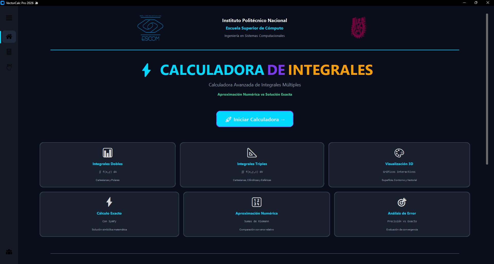

# ⚡ VectorCalc Pro 2026

<div align="center">


**Sistema Avanzado de Cálculo Integral y Visualización 3D** *Proyecto Terminal - Análisis Vectorial - ESCOM IPN*

[Reportar Bug](https://github.com/tu-usuario/tu-repo/issues) · [Solicitar Feature](https://github.com/tu-usuario/tu-repo/issues)

</div>

---

## 📄 Descripción

**VectorCalc Pro 2026** es una herramienta de software diseñada para estudiantes e ingenieros que buscan precisión y velocidad en el cálculo de integrales múltiples.

A diferencia de las calculadoras tradicionales, este sistema implementa una arquitectura de **Doble Verificación**: calcula simultáneamente la solución exacta (usando álgebra computacional simbólica) y una aproximación numérica (mediante Sumas de Riemann), permitiendo validar la convergencia de los resultados y detectar errores en tiempo real.

## ✨ Características Principales

* **🧮 Integración Múltiple:** Resolución de integrales dobles ($\iint$) y triples ($\iiint$).
* **🌐 Sistemas de Coordenadas:** Transformación automática con inyección de **Jacobianos**:
    * Cartesianas $(x, y, z)$
    * Cilíndricas $(r, \theta, z)$
    * Esféricas $(\rho, \phi, \theta)$
* **🎨 Visualización 3D:** Motor gráfico integrado para visualizar superficies, contornos y campos vectoriales.
* **⚡ Feedback en Tiempo Real:** Renderizado de ecuaciones en formato $\LaTeX$ mientras escribes.
* **🖥️ Interfaz Moderna:** Diseño *Dark Mode* optimizado con `CustomTkinter` para reducir la fatiga visual.

---

## 📸 Capturas de Pantalla

| Interfaz Principal | Graficadora 3D |
|:---:|:---:|
|  |  |
| *Entrada de datos y selección de coordenadas* | *Visualización de superficies y campos* |

---

## 🛠️ Tecnologías

El proyecto fue construido utilizando un stack científico robusto:

* **[Python](https://www.python.org/):** Lenguaje núcleo.
* **[CustomTkinter](https://github.com/TomSchimansky/CustomTkinter):** Framework UI moderno.
* **[SymPy](https://www.sympy.org/):** Motor de cálculo simbólico (Backend Exacto).
* **[NumPy](https://numpy.org/):** Computación numérica matricial (Backend Numérico).
* **[Matplotlib](https://matplotlib.org/):** Renderizado de gráficos 2D/3D y fórmulas matemáticas.

---

## 🚀 Instalación y Uso

Sigue estos pasos para ejecutar el proyecto en tu máquina local.

### Prerrequisitos

* Python 3.10 o superior.
* Git.

### Pasos

1.  **Clonar el repositorio**
    ```bash
    git clone [https://github.com/TU_USUARIO/VectorCalc-Pro-2026.git](https://github.com/TU_USUARIO/VectorCalc-Pro-2026.git)
    cd VectorCalc-Pro-2026
    ```

2.  **Crear un entorno virtual (Opcional pero recomendado)**
    ```bash
    python -m venv venv
    # En Windows:
    venv\Scripts\activate
    # En Linux/Mac:
    source venv/bin/activate
    ```

3.  **Instalar dependencias**
    ```bash
    pip install customtkinter numpy sympy matplotlib pillow
    ```

4.  **Ejecutar la aplicación**
    ```bash
    python "CODIGO FINAL.py"
    ```

---

## 🧠 Estructura del Código

El sistema sigue un patrón modular:

* `CalculadoraIntegrales`: Clase encargada de la lógica matemática, parsing de funciones y algoritmos de integración (Backend).
* `App`: Clase principal que hereda de `ctk.CTk`, maneja la interfaz gráfica, eventos y el hilo de ejecución (Frontend).
* `Threading`: Los cálculos pesados se ejecutan en hilos secundarios para evitar congelamientos de la interfaz.

---

## 👥 Autores

Este proyecto fue desarrollado con ❤️ por estudiantes de la **Escuela Superior de Cómputo (ESCOM)** del **IPN**:

* **Bonilla Hernández Ximena Sofía**
* **Castillo Vidal Carmen Andrea**
* **Cruz Rodríguez Bruno Aarón**

---

<div align="center">
    
**Materia:** Análisis Vectorial (Grupo 26-1)  
**Profesor:** Dr. David Correa Coyac  
    
---
    
*Hecho en México 🇲🇽 - 2026*

</div>